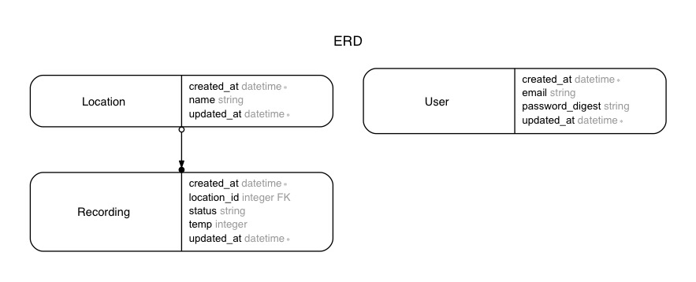

# Weather Api

In this repository, I will learn about building Rails api apps.

---

## Enforcing a default format

```rb
class ApiController < ApplicationController
  before_action :set_default_format

  private
    def set_default_format
      request.format = :json
    end
end
```

```rb
class Api::V1::LocationsController < ApiController
  # ...
end
```

---

## JWTs vs session cookies
- Both JWTs and session cookies are stateless. If we really want to keep track of
who is logged in; who logged out, we will need to implement a whitelist and blacklist
using database or in-memory state cache.

#### JWT
- Header + Payload + Signature ([docs](https://jwt.io/))
- Encoded with [Base64](https://www.base64decode.org/), anyone can decode a JWT
- Readable by Javascript
- Only the server knows the secret key, and using that key, it verifies that the information is valid
- Must manually add a JWT to a request header
- Need extra caution for XSS and XSRF

#### Rails session cookies
- Encrypted with secret key, only the server can decode a cookie
- HTTP-ONLY - not accessible from Javascript
- Cookies are automatically sent on every request
- Rails provides countermeasures against XSS and CSRF

---

## Knock gem
- [https://github.com/nsarno/knock](https://github.com/nsarno/knock)

---

## Models


